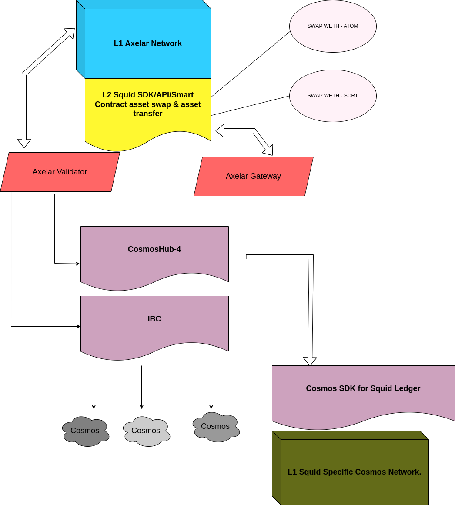
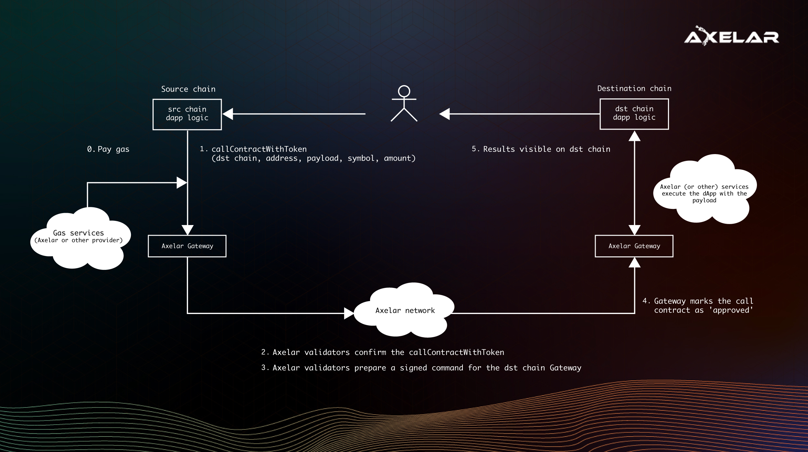

# crosschain-dapp
A decentralized application to asset swap cross chain with Squid protocol, Axelar network  - Cosmos and Ethereum.  The solution architecture defined in this document is for a decentralized application that allows asset transfers and all DeFi related features that can be done across different chain.  This brainstorming version is to attempt a solution to swap assets from Ethereum network and transfer asset to a Cosmos network.

## Squid Architectural Design

# Use Case 

A high level design and walk through on a potential asset swaps and forwards could be done using the technologies listed on the Technical Stack section.

## Technical Stack

Below are the possible tech stacks that comprises an end to end solution.

1. [**Axelar Network**](https://axelar.network/) - is a decentralized state machine responsible for facilitating cross-chain requests.  Axelar network will be the bridge between the Squid protocol for asset swapping and transfer to another blockchain network.
2. [**Squid**](https://0xsquid.com/) - a liquidity and messaging router on Axelar network. It enables native token swaps and messaging between any user or application, regardless of the chain they’re on. Wrap our smart contracts, API and SDK to enable composable, cross-chain financial logic in the simplest possible way.
3. [**Cosmos**](https://cosmos.network) - is an application specific blockchain network.  Tendermint is used to build the blockchain and a series of API is  deloped to provide interaction and transactions of the blockchain. 

## Desgin Walk Through

We will use Axelar to the message transfer engine.  

Squid's router protocol can be wrapped around a DApp application like Uniswap's asset swap dialog box or a smart contract on Ethereum's smart contract using Solidity.

From a Javascript (React or Nodejs) perspective, the code would look similar to the below code snippet.

`const result = await squid.route(
    0.183, 
    "eth", 
    "ethereum",
    "awc", 
    "cosmoshub-4",
);`
`const { route } = result;`
`const tx = squid.executeRoute(signer, route)`
`await tx.wait();`
`const status = await squid.getStatus(tx.hash);`

The logic to perform the swap is entirely application dependent.  For example, the asset swap logic can be based on **Uniswap's V3** routing protocol.

A function invocation of Axelar's **CallContractWithToken** will start the transfer of the swap result to the Cosmos chain.  After the Axelar gateway flow, the route will direct to Squid's Cosmos on-chain application. 

Cosmos is an application specific network.  An API is built top of tendermint to provide the functionalities of the transfer.  

